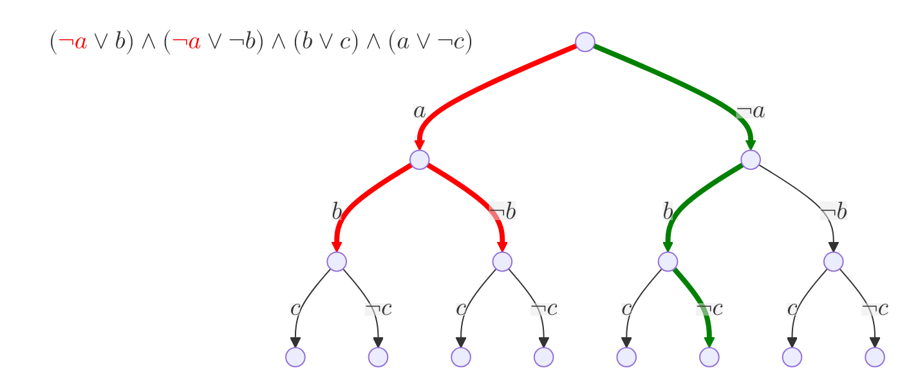
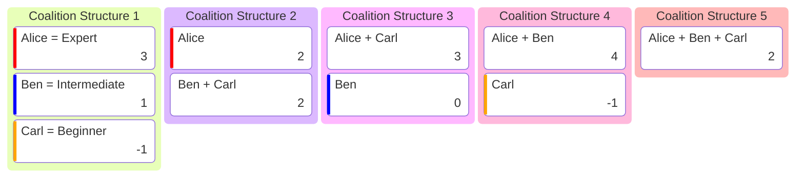
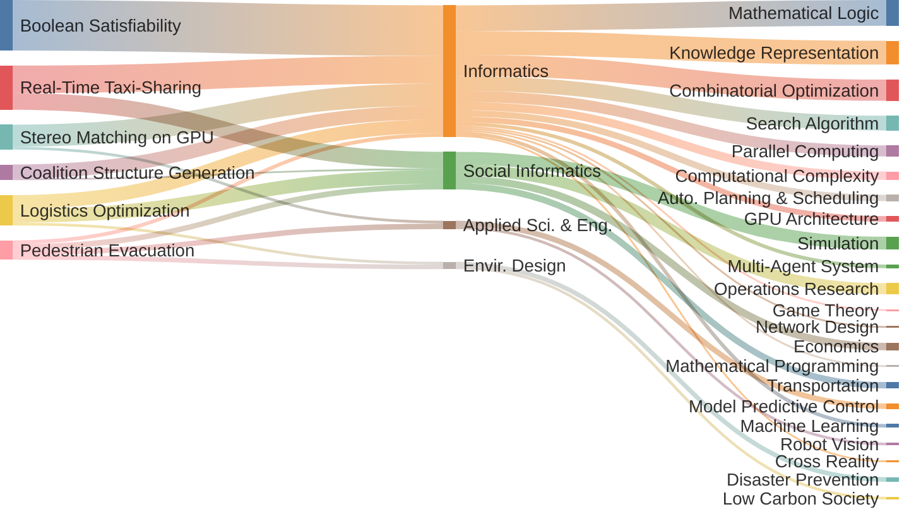
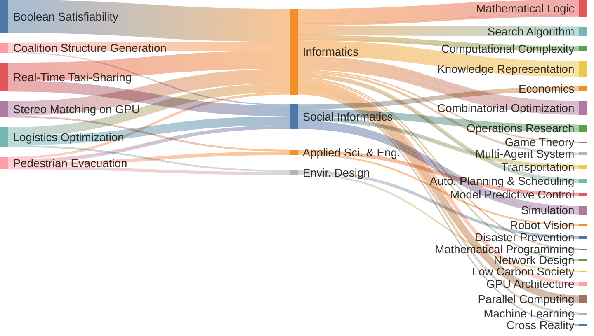

#### Boolean Satisfiability Encoding and Solving

「充足可能性問題」，通称「SAT問題」は，与えられた命題論理式を満たす変数割当てが存在するかどうかを判定する問題である．上の図に示すように，論理変数 $a$ を真とすると，$b$ の割当てが矛盾に陥す．SAT問題の効率的な解法は，理論計算機科学における最も重要な課題の一つである．

> "*N*-level modulo-based CNF encodings of pseudo-Boolean constraints for MaxSAT". **Aolong Zha**, Miyuki Koshimura, Hiroshi Fujita. _Constraints_, Vol. 24(2), 2019, pp. 133--161. &nbsp;[<i class="fas fa-paperclip"></i>](/bibs.html#Zha_N) &nbsp;[<i class="ai ai-doi"></i>](https://doi.org/10.1007/s10601-018-9299-0)

> 2nd place award in _Random SAT Track_, SAT Competition 2018 &nbsp;[<i class="fas fa-medal"></i>](/images/gluHack.pdf)

---

#### Coalition Structure Generation for Partition Function Games

「提携構造形成問題」は，協力ゲーム理論の問題の一つであり，エージェント集合を社会的利得が最大となるよう分割する問題である．上の図に示すように，上級者・中級者・初心者を含む3人の集合があって，彼らそれぞれの貢献度は，どのようにチームを組むかによって多少変動する．いかにして彼らを組合せ，最大の社会的価値を生み出すか，それがこの問題の本質である．

> "Coalition structure generation for partition function games utilizing a concise graphical representation". **Aolong Zha**, Kazuki Nomoto, Suguru Ueda, Miyuki Koshimura, Yuko Sakurai, Makoto Yokoo. In _Proc. of 20th International Conference on Principles and Practice of Multi-Agent Systems_, 2017, pp. 143--159. &nbsp;[<i class="fas fa-paperclip"></i>](/bibs.html#Zha_CSG) &nbsp;[<i class="ai ai-doi"></i>](https://doi.org/10.1007/978-3-319-69131-2_9)

---

#### Real-Time Taxi-Sharing Assignment

{: width="360" }

利用者は乗車希望時刻と場所，及び降車希望時刻と場所を配車システムに送信する．システムはその条件に基づき最適化を行い，タクシーをリアルタイムで割り当てる．従来のタクシーサービスと異なり，このシステムは異なる利用者のリクエストを考慮し，相乗りを可能にすることで運賃の削減を図る．

> "An incremental SAT-based approach for solving the real-time taxi-sharing service problem". **Aolong Zha**, Qiong Chang, Ituski Noda. _Discrete Applied Mathematics_, Vol. 335, 2023, pp. 131--145. &nbsp;[<i class="fas fa-paperclip"></i>](/bibs.html#Zha_An) &nbsp;[<i class="ai ai-doi"></i>](https://doi.org/10.1016/j.dam.2022.08.008)

> Trial conducted in 2022; patent granted in 2023. [<i class="fas fa-file-circle-check"></i>](https://www.nedo.go.jp/news/press/AA5_101506.html) &nbsp;[<i class="fas fa-file-powerpoint"></i>](https://www.j-platpat.inpit.go.jp/c1801/PU/JP-7294660/15/en)

---

#### Pedestrian Evacuation Simulation and Optimization

{: width="640" }

歩行者道路網は大規模群集による混雑で事故が発生しやすい．本研究は，ハイブリッド群集モデルとモデル予測制御を組み合わせ，ネットワーク全体の動態を離散・連続の両面から同時に監視・制御する枠組みを考案し，群集分布の均衡維持と飽和リスク低減を求める．

> "Hybrid modeling and predictive control of large-scale crowd movement in road network". Rongxuan Gao, **Aolong Zha**, Shusuke Shigenaka, Masaki Onishi. In _Proc. of 24th International Conference on Hybrid Systems: Computation and Control_, 2021, pp. 26:1--26:7. &nbsp;[<i class="fas fa-paperclip"></i>](/bibs.html#Gao_Hyb) &nbsp;[<i class="ai ai-doi"></i>](https://doi.org/10.1145/3447928.3456641)

---

#### Optimization for Logistics and Transportation

{: width="360" }

近年，「物流2024年問題」対策や「カーボンニュートラル実現」に向け，道路輸送から鉄道貨物への転換が進められている．これら二つの輸送モードの組合せによる輸送コストとCO2排出量のパレート解を求め，そのトレードオフ関係を明らかにする．

> "Optimization of transport costs and CO2 emissions through modal shift to railways using actual shipment amount" (in Japaneses). Hitoshi Hara, **Aolong Zha**, Naoto Imura. _Journal of Japan Logistics Society_, Vol. 32, 2024, pp. 52--62. &nbsp;[<i class="fas fa-paperclip"></i>](/bibs.html#Hara_Opt) &nbsp;[<i class="ai ai-doi"></i>](https://id.ndl.go.jp/bib/033641668)

---

#### Stereo Matching on Embedded GPUs

計算資源が限られた組み込みGPU向けに最適化されたステレオマッチングフレームワークを考案し，効率的かつ高精度な深度推定を実現する．これにより，リアルタイムでの距離計測や障害物検知など，車載システム・ドローン向け応用場面でも実用的な性能を発揮できる．

> "Efficient stereo matching on embedded GPUs with zero-means cross correlation". Qiong Chang, **Aolong Zha**, Weimin Wang, Xin Liu, Masaki Onishi, Lei Lei, Tsutomu Maruyama. _Journal of Systems Architecture_, Vol. 123, 2022, p. 102366. &nbsp;[<i class="fas fa-paperclip"></i>](/bibs.html#Chang_Effi) &nbsp;[<i class="ai ai-doi"></i>](https://doi.org/10.1016/j.sysarc.2021.102366)

<!--
---

 
<strong>Interdisciplinary Relevance of Contributions</strong>

<li class="d-flex justify-content-between px-md-4">
<strong>Research</strong>
<strong>Fields</strong>
<strong>Keywords</strong>
</li>

-->

<!--

-->

