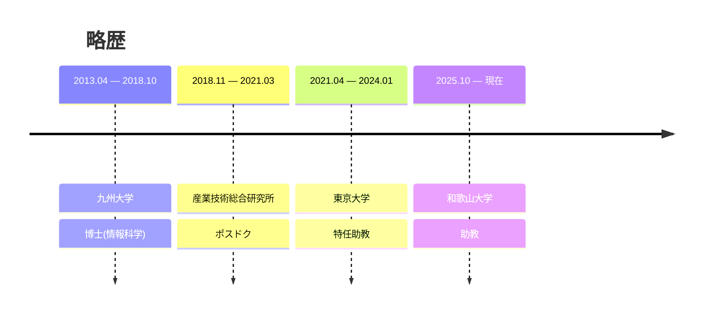

# **査 澳龍** <strong><i>ｻﾞ ｵｸﾘｭｳ</i></strong>

#### **研究キーワード**

探索アルゴリズム、充足可能性問題、組合せ最適化、オペレーションズ・リサーチ、GPGPU 
[Google Scholar](https://scholar.google.com/citations?user=iNdsu_kAAAAJ)・
[DBLP](https://dblp.org/pid/207/5208)・
[researchmap](https://researchmap.jp/aolong_zha)