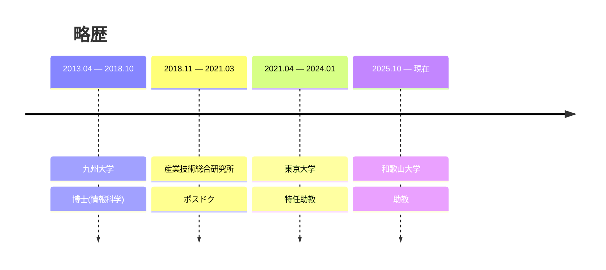

# **査 澳龍** <strong><i>ｻﾞ ｵｸﾘｭｳ</i></strong>

```mermaid
timeline
  title 略歴
	2013.04 — 2018.10 : 九州大学 : 博士(情報科学)
	2018.11 — 2021.03 : 産業技術総合研究所 : ポスドク
	2021.04 — 2024.01 : 東京大学 : 特任助教
	2025.10 — 現在 : 和歌山大学 : 助教
```

#### **研究キーワード**

探索アルゴリズム，充足可能性問題，組合せ最適化，オペレーションズ・リサーチ，高性能計算 
[Google Scholar](https://scholar.google.com/citations?user=iNdsu_kAAAAJ)・
[DBLP](https://dblp.org/pid/207/5208)・
[researchmap](https://researchmap.jp/aolong_zha)

> **致有意来和歌山大学攻读硕士或博士学位的国际学生**
>
> 欢迎已获得学士或硕士学位，并有意加入我在和歌山大学研究室的国际学生与我联系。这包括计划先以*研究生（Research Student）*身份入学，之后升入学位课程的申请者，以及通过奖学金项目或其他招生途径直接申请硕士/博士课程的申请者。
{: .prompt-info}